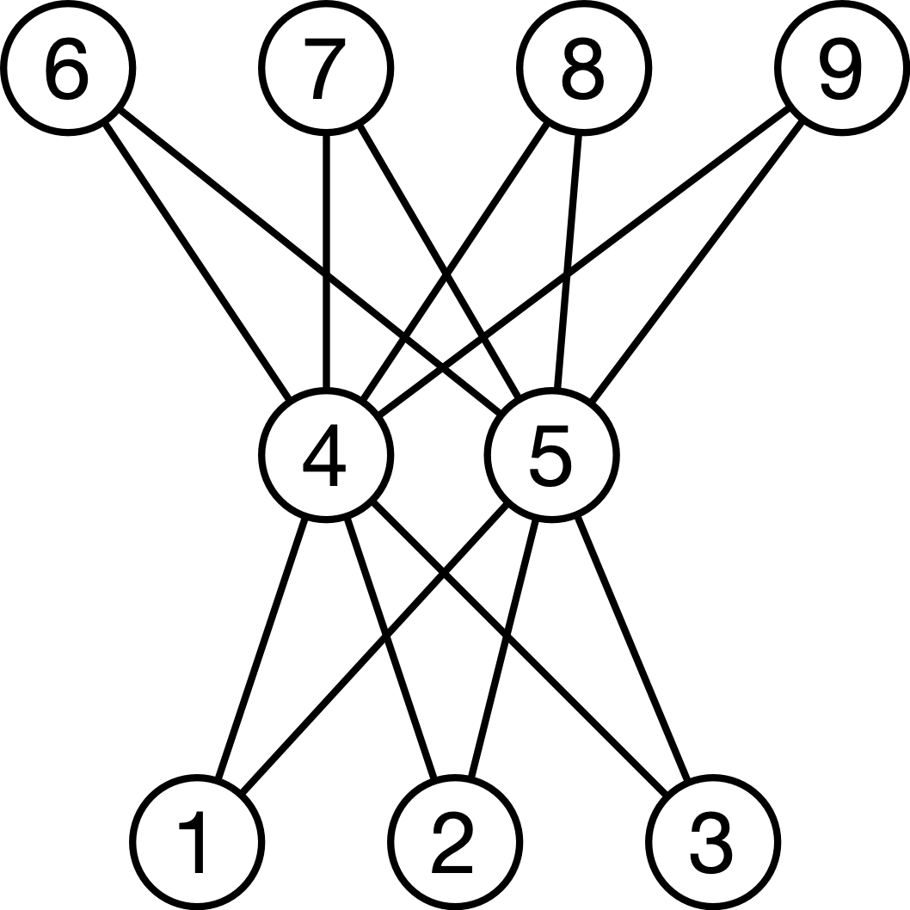

# Gallery of Standard Posets

Images of some standard posets from the `Posets` module.

## `antichain(4)`


## `chain(4)`


## `chevron()`


## `crown(5,2)`


## `subset_lattice(3)`


```
julia> for k=1:8
       println(k," -> ",subset_decode(k))
       end
1 -> Ø
2 -> {1}
3 -> {2}
4 -> {1,2}
5 -> {3}
6 -> {1,3}
7 -> {2,3}
8 -> {1,2,3}
```


## `weak_order([1,1,1,2,2,3,3,3,3])`


